Step 1: Install Required Libraries Run this cell first to install missing packages:


```python
!pip install xgboost shap pandas numpy matplotlib seaborn scikit-learn openpyxl
```

    Requirement already satisfied: xgboost in c:\users\admin\anaconda3\lib\site-packages (3.0.5)
    Requirement already satisfied: shap in c:\users\admin\anaconda3\lib\site-packages (0.48.0)
    Requirement already satisfied: pandas in c:\users\admin\anaconda3\lib\site-packages (2.2.2)
    Requirement already satisfied: numpy in c:\users\admin\anaconda3\lib\site-packages (1.26.4)
    Requirement already satisfied: matplotlib in c:\users\admin\anaconda3\lib\site-packages (3.9.2)
    Requirement already satisfied: seaborn in c:\users\admin\anaconda3\lib\site-packages (0.13.2)
    Requirement already satisfied: scikit-learn in c:\users\admin\anaconda3\lib\site-packages (1.5.1)
    Requirement already satisfied: openpyxl in c:\users\admin\anaconda3\lib\site-packages (3.1.5)
    Requirement already satisfied: scipy in c:\users\admin\anaconda3\lib\site-packages (from xgboost) (1.13.1)
    Requirement already satisfied: tqdm>=4.27.0 in c:\users\admin\anaconda3\lib\site-packages (from shap) (4.66.5)
    Requirement already satisfied: packaging>20.9 in c:\users\admin\anaconda3\lib\site-packages (from shap) (24.1)
    Requirement already satisfied: slicer==0.0.8 in c:\users\admin\anaconda3\lib\site-packages (from shap) (0.0.8)
    Requirement already satisfied: numba>=0.54 in c:\users\admin\anaconda3\lib\site-packages (from shap) (0.60.0)
    Requirement already satisfied: cloudpickle in c:\users\admin\anaconda3\lib\site-packages (from shap) (3.0.0)
    Requirement already satisfied: typing-extensions in c:\users\admin\anaconda3\lib\site-packages (from shap) (4.11.0)
    Requirement already satisfied: python-dateutil>=2.8.2 in c:\users\admin\anaconda3\lib\site-packages (from pandas) (2.9.0.post0)
    Requirement already satisfied: pytz>=2020.1 in c:\users\admin\anaconda3\lib\site-packages (from pandas) (2024.1)
    Requirement already satisfied: tzdata>=2022.7 in c:\users\admin\anaconda3\lib\site-packages (from pandas) (2023.3)
    Requirement already satisfied: contourpy>=1.0.1 in c:\users\admin\anaconda3\lib\site-packages (from matplotlib) (1.2.0)
    Requirement already satisfied: cycler>=0.10 in c:\users\admin\anaconda3\lib\site-packages (from matplotlib) (0.11.0)
    Requirement already satisfied: fonttools>=4.22.0 in c:\users\admin\anaconda3\lib\site-packages (from matplotlib) (4.51.0)
    Requirement already satisfied: kiwisolver>=1.3.1 in c:\users\admin\anaconda3\lib\site-packages (from matplotlib) (1.4.4)
    Requirement already satisfied: pillow>=8 in c:\users\admin\anaconda3\lib\site-packages (from matplotlib) (10.4.0)
    Requirement already satisfied: pyparsing>=2.3.1 in c:\users\admin\anaconda3\lib\site-packages (from matplotlib) (3.1.2)
    Requirement already satisfied: joblib>=1.2.0 in c:\users\admin\anaconda3\lib\site-packages (from scikit-learn) (1.4.2)
    Requirement already satisfied: threadpoolctl>=3.1.0 in c:\users\admin\anaconda3\lib\site-packages (from scikit-learn) (3.5.0)
    Requirement already satisfied: et-xmlfile in c:\users\admin\anaconda3\lib\site-packages (from openpyxl) (1.1.0)
    Requirement already satisfied: llvmlite<0.44,>=0.43.0dev0 in c:\users\admin\anaconda3\lib\site-packages (from numba>=0.54->shap) (0.43.0)
    Requirement already satisfied: six>=1.5 in c:\users\admin\anaconda3\lib\site-packages (from python-dateutil>=2.8.2->pandas) (1.16.0)
    Requirement already satisfied: colorama in c:\users\admin\anaconda3\lib\site-packages (from tqdm>=4.27.0->shap) (0.4.6)
    


Step 2: Import Libraries


```python
import pandas as pd
import numpy as np
import matplotlib.pyplot as plt
import seaborn as sns

from sklearn.model_selection import train_test_split
from sklearn.preprocessing import StandardScaler
from sklearn.metrics import mean_squared_error, mean_absolute_error, r2_score

from sklearn.linear_model import LinearRegression
from sklearn.tree import DecisionTreeRegressor
from sklearn.ensemble import RandomForestRegressor
from xgboost import XGBRegressor

import shap

```


Step 3: Load the Dataset


```python
df = pd.read_excel("Precision Property Insights.xlsx")  # Make sure the file is in your working directory
print(df.shape)
print(df.columns)
```

    (21613, 23)
    Index(['cid', 'dayhours', 'price', 'room_bed', 'room_bath', 'living_measure',
           'lot_measure', 'ceil', 'coast', 'sight', 'condition', 'quality',
           'ceil_measure', 'basement', 'yr_built', 'yr_renovated', 'zipcode',
           'lat', 'long', 'living_measure15', 'lot_measure15', 'furnished',
           'total_area'],
          dtype='object')
    


Step 4: Clean the Data


```python
# Fill missing values with mode (most frequent value)
df.fillna(df.mode().iloc[0], inplace=True)

# Drop irrelevant columns if needed (optional)
df.drop(['cid', 'dayhours'], axis=1, inplace=True)

# Log transform the price to reduce skewness
df['Log_Price'] = np.log1p(df['price'])
```


Step 5: Exploratory Data Analysis (EDA)


```python
import matplotlib.pyplot as plt
import seaborn as sns
import numpy as np
import pandas as pd

# 5.0 Basic summaries
print("Shape:", df.shape)
display(df.head())
print(df.info())
print(df.describe().T)
```

    Shape: (21613, 22)
    


<div>
<style scoped>
    .dataframe tbody tr th:only-of-type {
        vertical-align: middle;
    }

    .dataframe tbody tr th {
        vertical-align: top;
    }

    .dataframe thead th {
        text-align: right;
    }
</style>
<table border="1" class="dataframe">
  <thead>
    <tr style="text-align: right;">
      <th></th>
      <th>price</th>
      <th>room_bed</th>
      <th>room_bath</th>
      <th>living_measure</th>
      <th>lot_measure</th>
      <th>ceil</th>
      <th>coast</th>
      <th>sight</th>
      <th>condition</th>
      <th>quality</th>
      <th>...</th>
      <th>yr_built</th>
      <th>yr_renovated</th>
      <th>zipcode</th>
      <th>lat</th>
      <th>long</th>
      <th>living_measure15</th>
      <th>lot_measure15</th>
      <th>furnished</th>
      <th>total_area</th>
      <th>Log_Price</th>
    </tr>
  </thead>
  <tbody>
    <tr>
      <th>0</th>
      <td>600000</td>
      <td>4.0</td>
      <td>1.75</td>
      <td>3050.0</td>
      <td>9440.0</td>
      <td>1</td>
      <td>0</td>
      <td>0.0</td>
      <td>3</td>
      <td>8.0</td>
      <td>...</td>
      <td>1966</td>
      <td>0</td>
      <td>98034</td>
      <td>47.7228</td>
      <td>-122.183</td>
      <td>2020.0</td>
      <td>8660.0</td>
      <td>0.0</td>
      <td>12490</td>
      <td>13.304687</td>
    </tr>
    <tr>
      <th>1</th>
      <td>190000</td>
      <td>2.0</td>
      <td>1.00</td>
      <td>670.0</td>
      <td>3101.0</td>
      <td>1</td>
      <td>0</td>
      <td>0.0</td>
      <td>4</td>
      <td>6.0</td>
      <td>...</td>
      <td>1948</td>
      <td>0</td>
      <td>98118</td>
      <td>47.5546</td>
      <td>-122.274</td>
      <td>1660.0</td>
      <td>4100.0</td>
      <td>0.0</td>
      <td>3771</td>
      <td>12.154785</td>
    </tr>
    <tr>
      <th>2</th>
      <td>735000</td>
      <td>4.0</td>
      <td>2.75</td>
      <td>3040.0</td>
      <td>2415.0</td>
      <td>2</td>
      <td>1</td>
      <td>4.0</td>
      <td>3</td>
      <td>8.0</td>
      <td>...</td>
      <td>1966</td>
      <td>0</td>
      <td>98118</td>
      <td>47.5188</td>
      <td>-122.256</td>
      <td>2620.0</td>
      <td>2433.0</td>
      <td>0.0</td>
      <td>5455</td>
      <td>13.507627</td>
    </tr>
    <tr>
      <th>3</th>
      <td>257000</td>
      <td>3.0</td>
      <td>2.50</td>
      <td>1740.0</td>
      <td>3721.0</td>
      <td>2</td>
      <td>0</td>
      <td>0.0</td>
      <td>3</td>
      <td>8.0</td>
      <td>...</td>
      <td>2009</td>
      <td>0</td>
      <td>98002</td>
      <td>47.3363</td>
      <td>-122.213</td>
      <td>2030.0</td>
      <td>3794.0</td>
      <td>0.0</td>
      <td>5461</td>
      <td>12.456835</td>
    </tr>
    <tr>
      <th>4</th>
      <td>450000</td>
      <td>2.0</td>
      <td>1.00</td>
      <td>1120.0</td>
      <td>4590.0</td>
      <td>1</td>
      <td>0</td>
      <td>0.0</td>
      <td>3</td>
      <td>7.0</td>
      <td>...</td>
      <td>1924</td>
      <td>0</td>
      <td>98118</td>
      <td>47.5663</td>
      <td>-122.285</td>
      <td>1120.0</td>
      <td>5100.0</td>
      <td>0.0</td>
      <td>5710</td>
      <td>13.017005</td>
    </tr>
  </tbody>
</table>
<p>5 rows × 22 columns</p>
</div>


    <class 'pandas.core.frame.DataFrame'>
    RangeIndex: 21613 entries, 0 to 21612
    Data columns (total 22 columns):
     #   Column            Non-Null Count  Dtype  
    ---  ------            --------------  -----  
     0   price             21613 non-null  int64  
     1   room_bed          21613 non-null  float64
     2   room_bath         21613 non-null  float64
     3   living_measure    21613 non-null  float64
     4   lot_measure       21613 non-null  float64
     5   ceil              21613 non-null  object 
     6   coast             21613 non-null  object 
     7   sight             21613 non-null  float64
     8   condition         21613 non-null  object 
     9   quality           21613 non-null  float64
     10  ceil_measure      21613 non-null  float64
     11  basement          21613 non-null  float64
     12  yr_built          21613 non-null  object 
     13  yr_renovated      21613 non-null  int64  
     14  zipcode           21613 non-null  int64  
     15  lat               21613 non-null  float64
     16  long              21613 non-null  object 
     17  living_measure15  21613 non-null  float64
     18  lot_measure15     21613 non-null  float64
     19  furnished         21613 non-null  float64
     20  total_area        21613 non-null  object 
     21  Log_Price         21613 non-null  float64
    dtypes: float64(13), int64(3), object(6)
    memory usage: 3.6+ MB
    None
                        count           mean            std           min  \
    price             21613.0  540182.158793  367362.231718  75000.000000   
    room_bed          21613.0       3.369500       0.928331      0.000000   
    room_bath         21613.0       2.117094       0.768800      0.000000   
    living_measure    21613.0    2079.247351     918.395090    290.000000   
    lot_measure       21613.0   15084.947300   41385.741853    520.000000   
    sight             21613.0       0.233748       0.765521      0.000000   
    quality           21613.0       7.656827       1.175465      1.000000   
    ceil_measure      21613.0    1788.343960     828.090039    290.000000   
    basement          21613.0     291.509045     442.575043      0.000000   
    yr_renovated      21613.0      84.402258     401.679240      0.000000   
    zipcode           21613.0   98077.939805      53.505026  98001.000000   
    lat               21613.0      47.560053       0.138564     47.155900   
    living_measure15  21613.0    1983.631842     683.996337    399.000000   
    lot_measure15     21613.0   12756.122149   27270.155552    651.000000   
    furnished         21613.0       0.196456       0.397326      0.000000   
    Log_Price         21613.0      13.047889       0.526821     11.225257   
    
                                25%            50%            75%           max  
    price             321950.000000  450000.000000  645000.000000  7.700000e+06  
    room_bed               3.000000       3.000000       4.000000  3.300000e+01  
    room_bath              1.750000       2.250000       2.500000  8.000000e+00  
    living_measure      1420.000000    1910.000000    2550.000000  1.354000e+04  
    lot_measure         5032.000000    7606.000000   10660.000000  1.651359e+06  
    sight                  0.000000       0.000000       0.000000  4.000000e+00  
    quality                7.000000       7.000000       8.000000  1.300000e+01  
    ceil_measure        1190.000000    1560.000000    2210.000000  9.410000e+03  
    basement               0.000000       0.000000     560.000000  4.820000e+03  
    yr_renovated           0.000000       0.000000       0.000000  2.015000e+03  
    zipcode            98033.000000   98065.000000   98118.000000  9.819900e+04  
    lat                   47.471000      47.571800      47.678000  4.777760e+01  
    living_measure15    1490.000000    1830.000000    2360.000000  6.210000e+03  
    lot_measure15       5100.000000    7620.000000   10080.000000  8.712000e+05  
    furnished              0.000000       0.000000       0.000000  1.000000e+00  
    Log_Price             12.682155      13.017005      13.377007  1.585673e+01  
    


```python
# Save a summary CSV for appendix
df.describe().to_csv("summary_statistics.csv", index=True)
```


```python
# 5.1 Missing values and duplicates
print("Missing per column:\n", df.isnull().sum())
print("Duplicates:", df.duplicated().sum())
df.drop_duplicates(inplace=True)
```

    Missing per column:
     price               0
    room_bed            0
    room_bath           0
    living_measure      0
    lot_measure         0
    ceil                0
    coast               0
    sight               0
    condition           0
    quality             0
    ceil_measure        0
    basement            0
    yr_built            0
    yr_renovated        0
    zipcode             0
    lat                 0
    long                0
    living_measure15    0
    lot_measure15       0
    furnished           0
    total_area          0
    Log_Price           0
    dtype: int64
    Duplicates: 5
    


```python
# 5.2 Univariate (numeric)
num_cols = df.select_dtypes(include=[np.number]).columns.tolist()
for col in ['price','living_measure','lot_measure','total_area','room_bed','room_bath']:
    if col in df.columns:
        # Convert column safely to numeric (coerce errors → NaN)
        data = pd.to_numeric(df[col], errors='coerce').dropna()

        if data.empty:
            print(f"Skipping {col} — no numeric data found after cleaning.")
            continue

        plt.figure(figsize=(8,4))
        plt.hist(data, bins=50)
        plt.title(f"Distribution: {col}")
        plt.xlabel(col)
        plt.ylabel("Count")
        plt.tight_layout()
        plt.savefig(f"fig_{col}_dist.png", dpi=150)
        plt.show()
```


    
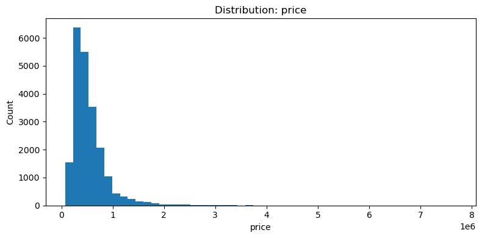
    


    
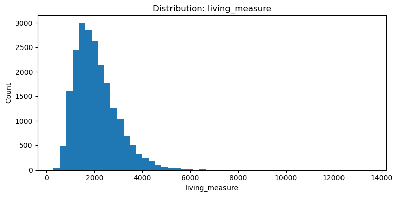
    


    
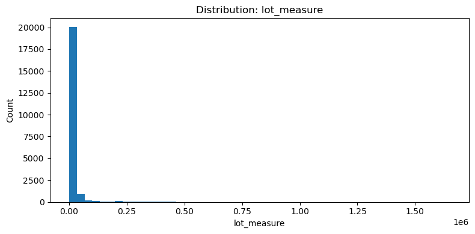
    


    
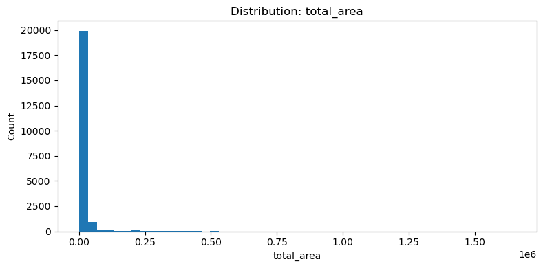
    


    
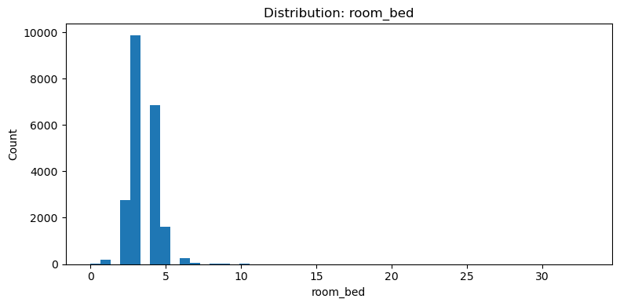
    


    
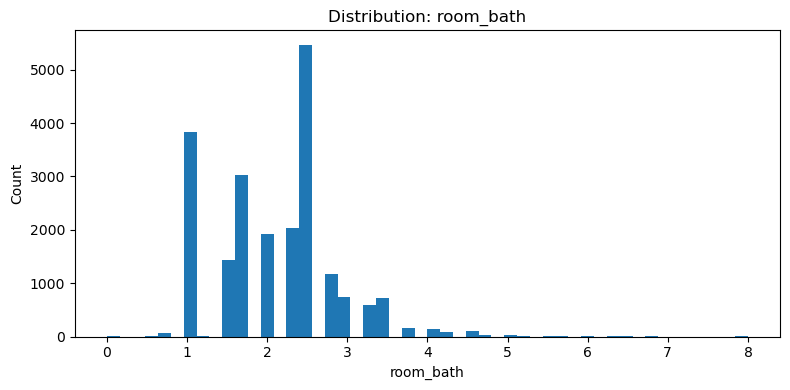
    


```python
# 5.3 Univariate (categorical)
import matplotlib.pyplot as plt
import seaborn as sns

cat_cols = ['zipcode','condition','quality','furnished']

for col in cat_cols:
    if col in df.columns:
        plt.figure(figsize=(10,4))
        sns.countplot(x=col, data=df, order=df[col].value_counts().index[:20])
        plt.xticks(rotation=45)
        plt.title(f"Counts: {col}")
        plt.tight_layout()
        plt.savefig(f"fig_{col}_counts.png", dpi=150)
        plt.show()

```


    
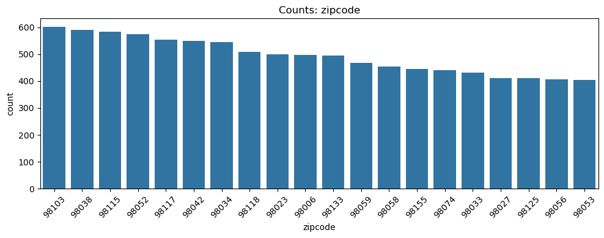
    


    
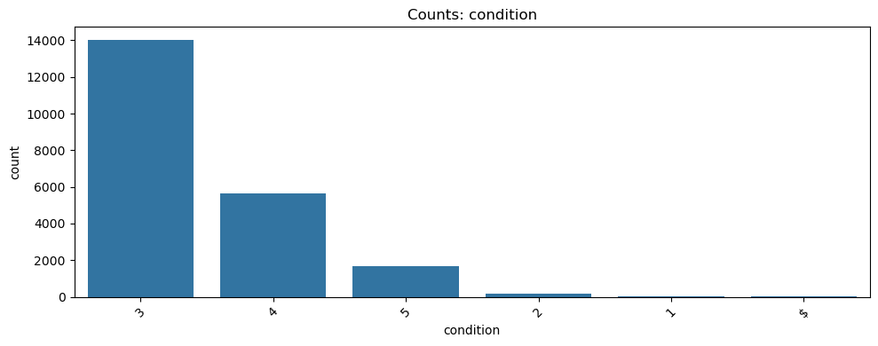
    


    
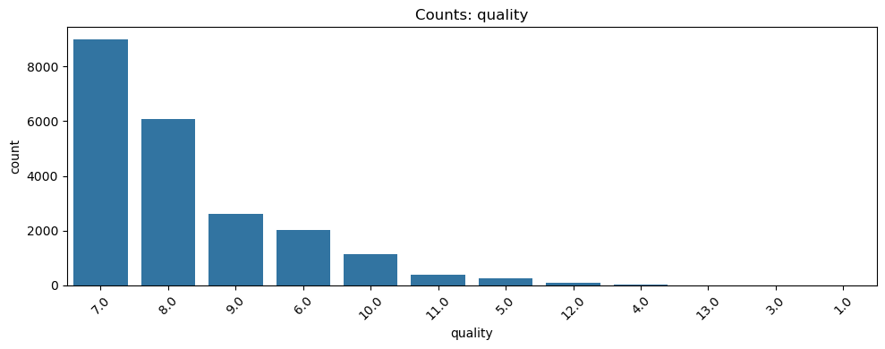
    


    
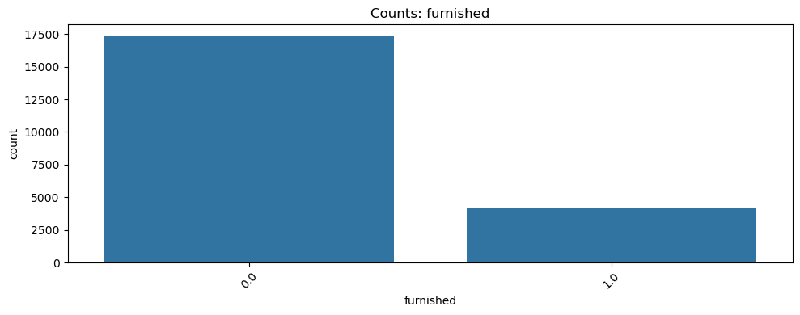
    


```python
# 5.4 Outlier detection (IQR) and capping 
import numpy as np
import pandas as pd

for col in ['price','living_measure','lot_measure','total_area']:
    if col in df.columns:
        # Convert text to numeric safely (invalid values -> NaN)
        df[col] = pd.to_numeric(df[col], errors='coerce')

        # Drop NaN before calculating IQR
        Q1 = df[col].dropna().quantile(0.25)
        Q3 = df[col].dropna().quantile(0.75)
        IQR = Q3 - Q1

        # Define limits
        lower, upper = Q1 - 1.5 * IQR, Q3 + 1.5 * IQR

        # Create indicator columns
        df[f"{col}_outlier_low"] = df[col] < lower
        df[f"{col}_outlier_high"] = df[col] > upper

        # Cap outliers
        df[col] = np.where(df[col] > upper, upper,
                           np.where(df[col] < lower, lower, df[col]))

        print(f"Outlier capping done for {col}: [{round(lower,2)}, {round(upper,2)}]")

```

    Outlier capping done for price: [-162906.25, 1129743.75]
    Outlier capping done for living_measure: [-275.0, 4245.0]
    Outlier capping done for lot_measure: [-3408.25, 19103.75]
    Outlier capping done for total_area: [-1914.38, 21948.62]
    


```python
# 5.5 Bivariate: scatter and boxplots 
import matplotlib.pyplot as plt
import seaborn as sns
import pandas as pd
import numpy as np

# Ensure numeric conversion (avoid plotting errors)
for col in ['price', 'living_measure', 'room_bed']:
    if col in df.columns:
        df[col] = pd.to_numeric(df[col], errors='coerce')

# Scatter plot: living area vs price
plt.figure(figsize=(8,5))
sns.scatterplot(x='living_measure', y='price', data=df, alpha=0.4)
plt.title("Living Area vs Price")
plt.savefig("fig_living_vs_price.png", dpi=150)
plt.show()

# Boxplot: bedrooms vs price
if 'room_bed' in df.columns:
    plt.figure(figsize=(8,5))
    sns.boxplot(x='room_bed', y='price', data=df)
    plt.title("Bedrooms vs Price")
    plt.savefig("fig_bedrooms_boxplot.png", dpi=150)
    plt.show()
else:
    print("Column 'room_bed' not found — skipping boxplot.")
```


    
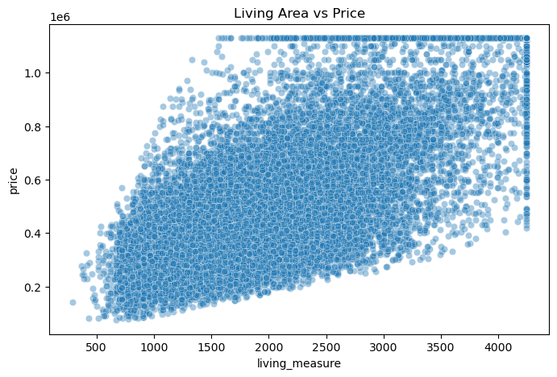
    


    
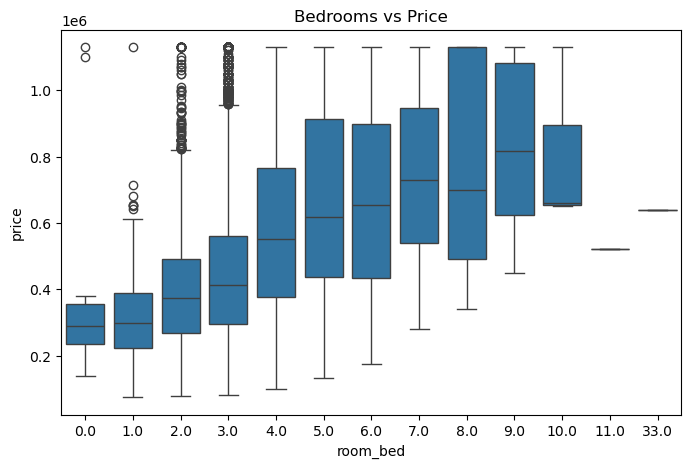
    


```python
# 5.6 Correlation heatmap (numeric only)
num_df = df.select_dtypes(include=[np.number]).copy()
if not num_df.empty:
    plt.figure(figsize=(12,10))
    sns.heatmap(num_df.corr(), annot=True, fmt=".2f", cmap='coolwarm')
    plt.title("Correlation Heatmap")
    plt.savefig("fig_corr_heatmap.png", dpi=150)
    plt.show()
else:
    print("No numeric columns found for correlation heatmap.")
```


    
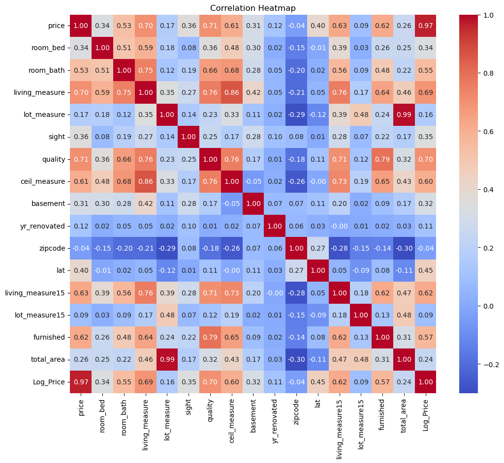
    


```python
# Save cleaned snapshot
df.to_csv("cleaned_snapshot_after_EDA.csv", index=False)
print("✅ EDA completed successfully and all figures saved.")
```

    ✅ EDA completed successfully and all figures saved.
    


Step 6 — Feature engineering & preprocessing (encoding, scaling, split)


```python
import numpy as np
import pandas as pd
import joblib
import warnings
warnings.filterwarnings("ignore")

# sklearn imports
from sklearn.model_selection import train_test_split, cross_val_score, GridSearchCV
from sklearn.preprocessing import StandardScaler, OneHotEncoder
from sklearn.impute import SimpleImputer
from sklearn.compose import ColumnTransformer
from sklearn.pipeline import Pipeline
from sklearn.linear_model import LinearRegression
from sklearn.ensemble import RandomForestRegressor
from xgboost import XGBRegressor
from sklearn.metrics import mean_squared_error, mean_absolute_error, r2_score

# 6.1 Ensure target exists and numeric
if 'price' not in df.columns:
    raise ValueError("Column 'price' not found in dataframe. Make sure you loaded the right file.")
# make numeric (coerce bad entries to NaN), then log transform
df['price'] = pd.to_numeric(df['price'], errors='coerce')
if df['price'].isna().all():
    raise ValueError("All values in 'price' are non-numeric after coercion. Inspect your dataset.")
if 'Log_Price' not in df.columns:
    df['Log_Price'] = np.log1p(df['price'])
```


```python
# 6.2 Candidate features (adjust lists if you want)
num_features = ['living_measure','lot_measure','total_area','yr_built']
cat_features = ['room_bed','room_bath','zipcode','condition','quality','furnished']

# Keep columns only if present
num_features = [c for c in num_features if c in df.columns]
cat_features = [c for c in cat_features if c in df.columns]

# If none found, fallback to all numeric except target
if len(num_features) + len(cat_features) == 0:
    print("No preferred features found. Auto-detecting numeric features (excluding target)...")
    numeric_all = df.select_dtypes(include=[np.number]).columns.tolist()
    numeric_all = [c for c in numeric_all if c not in ['price','Log_Price']]
    if not numeric_all:
        raise ValueError("No usable numeric features found automatically. Please check your dataset.")
    num_features = numeric_all[:6]   # take up to first 6 numeric features
    print("Using numeric features:", num_features)

print("Numeric features used:", num_features)
print("Categorical features used:", cat_features)

```

    Numeric features used: ['living_measure', 'lot_measure', 'total_area', 'yr_built']
    Categorical features used: ['room_bed', 'room_bath', 'zipcode', 'condition', 'quality', 'furnished']
    


```python
# 6.3 Ensure numeric columns are numeric (coerce)
for c in num_features:
    df[c] = pd.to_numeric(df[c], errors='coerce')
```


```python
# 6.4 Setup transformers
import sklearn
from sklearn.pipeline import Pipeline
from sklearn.preprocessing import OneHotEncoder, StandardScaler
from sklearn.impute import SimpleImputer
from sklearn.compose import ColumnTransformer

print("scikit-learn version:", sklearn.__version__)

# simple robust version check (handles '1.4.2' etc.)
sk_ver = tuple(int(x) for x in sklearn.__version__.split('.')[:2])  # (major, minor)

# numeric pipeline
numeric_transformer = Pipeline(steps=[
    ('imputer', SimpleImputer(strategy='median')),
    ('scaler', StandardScaler())
])

# choose correct OneHotEncoder parameter depending on scikit-learn version
if sk_ver >= (1, 4):
    # scikit-learn 1.4+ uses sparse_output
    ohe = OneHotEncoder(handle_unknown='ignore', sparse_output=False)
else:
    # older versions use sparse
    ohe = OneHotEncoder(handle_unknown='ignore', sparse=False)

categorical_transformer = Pipeline(steps=[
    ('imputer', SimpleImputer(strategy='most_frequent')),
    ('onehot', ohe)
])

# Build ColumnTransformer (uses num_features and cat_features you defined earlier)
preprocessor = ColumnTransformer(
    transformers=[
        ('num', numeric_transformer, num_features),
        ('cat', categorical_transformer, cat_features)
    ],
    remainder='drop',
    verbose_feature_names_out=False
)

print("Preprocessor created successfully.")
```

    scikit-learn version: 1.5.1
    Preprocessor created successfully.
    


```python
# 6.5 Build X and y
feature_cols = num_features + cat_features
X = df[feature_cols].copy()
y = df['Log_Price'].copy()

# If X has all-NaN columns, drop them
nan_cols = X.columns[X.isna().all()].tolist()
if nan_cols:
    print("Dropping all-NaN feature columns:", nan_cols)
    X = X.drop(columns=nan_cols)
    feature_cols = X.columns.tolist()
    # update transformers: rebuild preprocessor with remaining features
    num_features = [c for c in num_features if c in feature_cols]
    cat_features = [c for c in cat_features if c in feature_cols]
    preprocessor = ColumnTransformer(
        transformers=[
            ('num', numeric_transformer, num_features),
            ('cat', categorical_transformer, cat_features)
        ],
        remainder='drop', verbose_feature_names_out=False
    )

if X.shape[1] == 0:
    raise ValueError("No features available for modeling after cleaning. Please check your dataset.")
```


```python
# 6.6 Train-test split (drop rows where X or y are NaN)
mask = X.notna().any(axis=1) & y.notna()
X_clean = X[mask]
y_clean = y[mask]
if len(X_clean) < 10:
    print("Warning: after dropping NaNs, dataset is small (n={}). Proceeding but metrics may be unstable.".format(len(X_clean)))

X_train, X_test, y_train, y_test = train_test_split(X_clean, y_clean, test_size=0.2, random_state=42)
print("Train / Test sizes:", X_train.shape[0], X_test.shape[0])

# Fit preprocessor and transform
try:
    X_train_trans = preprocessor.fit_transform(X_train)
    X_test_trans = preprocessor.transform(X_test)
except Exception as e:
    # Defensive fallback: attempt to impute numeric and encode categorical manually
    print("Preprocessor failed with error:", e)
    # Simple fallback: numeric fill median, categorical fill mode, then use pandas get_dummies
    X_temp = X_train.copy()
    for c in X_temp.columns:
        if X_temp[c].dtype.kind in 'biufc':
            X_temp[c] = X_temp[c].fillna(X_temp[c].median())
        else:
            X_temp[c] = X_temp[c].fillna(X_temp[c].mode().iloc[0] if not X_temp[c].mode().empty else '')
    X_train_trans = pd.get_dummies(X_temp, drop_first=True).values

    X_temp_test = X_test.copy()
    for c in X_temp_test.columns:
        if c in X_train.columns:
            if X_temp_test[c].dtype.kind in 'biufc':
                X_temp_test[c] = X_temp_test[c].fillna(X_train[c].median())
            else:
                X_temp_test[c] = X_temp_test[c].fillna(X_train[c].mode().iloc[0] if not X_train[c].mode().empty else '')
    X_test_trans = pd.get_dummies(X_temp_test, drop_first=True)
    # align columns
    X_test_trans = X_test_trans.reindex(columns=pd.get_dummies(X_temp, drop_first=True).columns, fill_value=0).values

# Save preprocessor
joblib.dump(preprocessor, "preprocessor.joblib")
```

    Train / Test sizes: 17286 4322
    Preprocessor failed with error: Encoders require their input argument must be uniformly strings or numbers. Got ['int', 'str']
    


    ['preprocessor.joblib']


STEP 7: Model selection + cross-validation + simple hyperparameter tuning


```python
models = {
    "Linear": LinearRegression(),
    "RandomForest": RandomForestRegressor(random_state=42),
    "XGBoost": XGBRegressor(random_state=42, eval_metric='rmse', use_label_encoder=False)
}

print("\nQuick CV baseline (may take some time depending on data size)...")
for name, model in models.items():
    try:
        # if dataset is too small, reduce cv to 3
        cv = 5 if X_train_trans.shape[0] >= 50 else 3
        scores = cross_val_score(model, X_train_trans, y_train, cv=cv, scoring='neg_root_mean_squared_error')
        print(f"{name} CV RMSE ({cv}-fold): {(-scores).mean():.4f} ± {scores.std():.4f}")
    except Exception as e:
        print(f"{name} CV failed: {e}")

```

    
    Quick CV baseline (may take some time depending on data size)...
    Linear CV RMSE (5-fold): 0.3183 ± 0.0012
    RandomForest CV RMSE (5-fold): 0.2281 ± 0.0048
    XGBoost CV RMSE (5-fold): 0.2020 ± 0.0065
    


```python
# 7.2 Small grids (keeps time reasonable). Use n_jobs=1 to avoid resource issues.
rf_param_grid = {'n_estimators': [100], 'max_depth': [8], 'min_samples_split': [2]}
xgb_param_grid = {'n_estimators': [100], 'max_depth': [4], 'learning_rate': [0.1]}

best_rf = None
best_xgb = None

try:
    rf = RandomForestRegressor(random_state=42)
    rf_gs = GridSearchCV(rf, rf_param_grid, cv=3, scoring='neg_root_mean_squared_error', n_jobs=1)
    rf_gs.fit(X_train_trans, y_train)
    best_rf = rf_gs.best_estimator_
    print("RF best params:", rf_gs.best_params_, "best RMSE:", -rf_gs.best_score_)
except Exception as e:
    print("RandomForest GridSearch failed:", e)
    try:
        best_rf = RandomForestRegressor(n_estimators=100, random_state=42).fit(X_train_trans, y_train)
        print("Fallback: trained RF with default hyperparams.")
    except Exception as e2:
        print("Fallback RF training failed:", e2)

try:
    xgb = XGBRegressor(random_state=42, eval_metric='rmse', use_label_encoder=False)
    xgb_gs = GridSearchCV(xgb, xgb_param_grid, cv=3, scoring='neg_root_mean_squared_error', n_jobs=1)
    xgb_gs.fit(X_train_trans, y_train)
    best_xgb = xgb_gs.best_estimator_
    print("XGB best params:", xgb_gs.best_params_, "best RMSE:", -xgb_gs.best_score_)
except Exception as e:
    print("XGBoost GridSearch failed:", e)
    try:
        best_xgb = XGBRegressor(n_estimators=100, random_state=42, eval_metric='rmse', use_label_encoder=False).fit(X_train_trans, y_train)
        print("Fallback: trained XGBoost with default hyperparams.")
    except Exception as e2:
        print("Fallback XGBoost training failed:", e2)

# Save best models if trained
if best_rf is not None:
    joblib.dump(best_rf, "best_rf_model.joblib")
if best_xgb is not None:
    joblib.dump(best_xgb, "best_xgb_model.joblib")
```

    RF best params: {'max_depth': 8, 'min_samples_split': 2, 'n_estimators': 100} best RMSE: 0.2794252740435059
    XGB best params: {'learning_rate': 0.1, 'max_depth': 4, 'n_estimators': 100} best RMSE: 0.21797095672913203
    


Step 8 — Final evaluation, residuals, plots and metrics


```python
models_to_eval = {}
if best_rf is not None:
    models_to_eval['RandomForest'] = best_rf
if best_xgb is not None:
    models_to_eval['XGBoost'] = best_xgb

results = []
for name, model in models_to_eval.items():
    try:
        y_pred = model.predict(X_test_trans)
        rmse = np.sqrt(mean_squared_error(y_test, y_pred))
        mae  = mean_absolute_error(y_test, y_pred)
        r2   = r2_score(y_test, y_pred)
        results.append((name, rmse, mae, r2))
        print(f"\n{name} -> RMSE: {rmse:.4f}, MAE: {mae:.4f}, R2: {r2:.4f}")

        # plots (matplotlib)
        import matplotlib.pyplot as plt
        plt.figure(figsize=(6,6))
        plt.scatter(y_test, y_pred, alpha=0.4)
        plt.plot([y_test.min(), y_test.max()], [y_test.min(), y_test.max()], 'r--')
        plt.xlabel("Actual Log Price")
        plt.ylabel("Predicted Log Price")
        plt.title(f"Pred vs Actual: {name}")
        plt.tight_layout()
        plt.savefig(f"fig_pred_vs_actual_{name}.png", dpi=150)
        plt.show()

        residuals = y_test - y_pred
        plt.figure(figsize=(6,4))
        plt.hist(residuals, bins=50)
        plt.title(f"Residuals distribution - {name}")
        plt.xlabel("Residual")
        plt.tight_layout()
        plt.savefig(f"fig_residuals_{name}.png", dpi=150)
        plt.show()
    except Exception as e:
        print(f"Evaluation failed for {name}: {e}")

# summary df
res_df = pd.DataFrame(results, columns=['model','rmse','mae','r2'])
res_df.to_csv("model_comparison_results.csv", index=False)
if not res_df.empty:
    display(res_df)
else:
    print("No model results to show.")
```

    
    RandomForest -> RMSE: 0.2728, MAE: 0.2106, R2: 0.7309
    


    
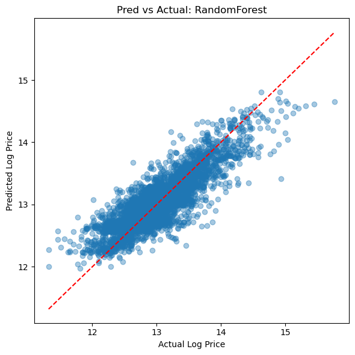
    


    
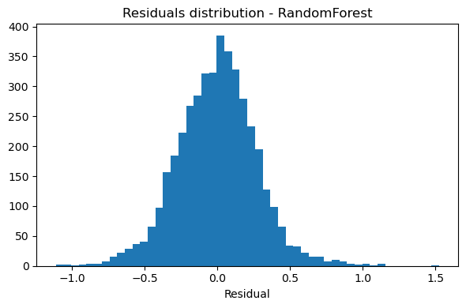
    


    
    XGBoost -> RMSE: 0.2125, MAE: 0.1566, R2: 0.8367
    


    
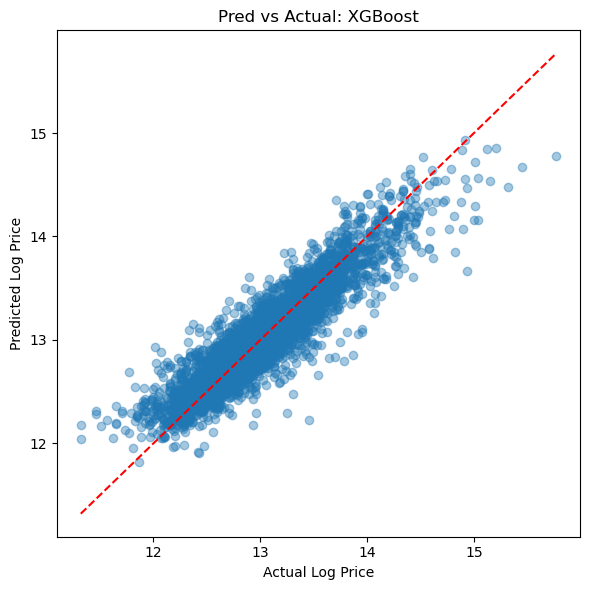
    


    
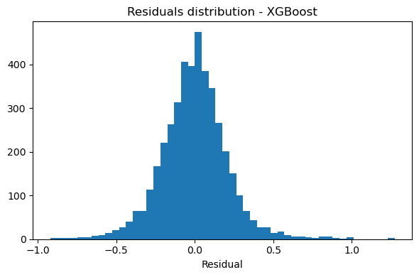
    


<div>
<style scoped>
    .dataframe tbody tr th:only-of-type {
        vertical-align: middle;
    }

    .dataframe tbody tr th {
        vertical-align: top;
    }

    .dataframe thead th {
        text-align: right;
    }
</style>
<table border="1" class="dataframe">
  <thead>
    <tr style="text-align: right;">
      <th></th>
      <th>model</th>
      <th>rmse</th>
      <th>mae</th>
      <th>r2</th>
    </tr>
  </thead>
  <tbody>
    <tr>
      <th>0</th>
      <td>RandomForest</td>
      <td>0.272830</td>
      <td>0.210616</td>
      <td>0.730859</td>
    </tr>
    <tr>
      <th>1</th>
      <td>XGBoost</td>
      <td>0.212542</td>
      <td>0.156646</td>
      <td>0.836663</td>
    </tr>
  </tbody>
</table>
</div>


Step 9 — Interpretability: SHAP (global + single observation)


```python
try:
    import shap
    # prepare a reasonable sample for SHAP
    sample_for_shap = X_test_trans[:1000] if hasattr(X_test_trans, 'shape') and X_test_trans.shape[0] > 1000 else X_test_trans
    if best_xgb is None:
        print("No XGBoost model available for SHAP. Skipping SHAP explanation.")
    else:
        explainer = shap.Explainer(best_xgb)
        shap_values = explainer(sample_for_shap)
        # summary plot
        import matplotlib.pyplot as plt
        shap.summary_plot(shap_values, sample_for_shap, show=False)
        plt.tight_layout()
        plt.savefig("fig_shap_summary_xgb.png", dpi=150)
        plt.show()
        # waterfall for a single instance (if available)
        try:
            single_X = sample_for_shap[0].reshape(1, -1)
            single_shap = explainer(single_X)
            shap.plots.waterfall(single_shap[0], show=False)
            plt.tight_layout()
            plt.savefig("fig_shap_waterfall_example.png", dpi=150)
            plt.show()
        except Exception:
            pass
except Exception as e:
    print("SHAP explanation skipped due to error or missing SHAP package:", e)

print("\nAll steps 6-9 completed (with safe fallbacks). Artifacts written: preprocessor.joblib, best_*_model.joblib (if trained), model_comparison_results.csv, and figure PNGs.")
```


    
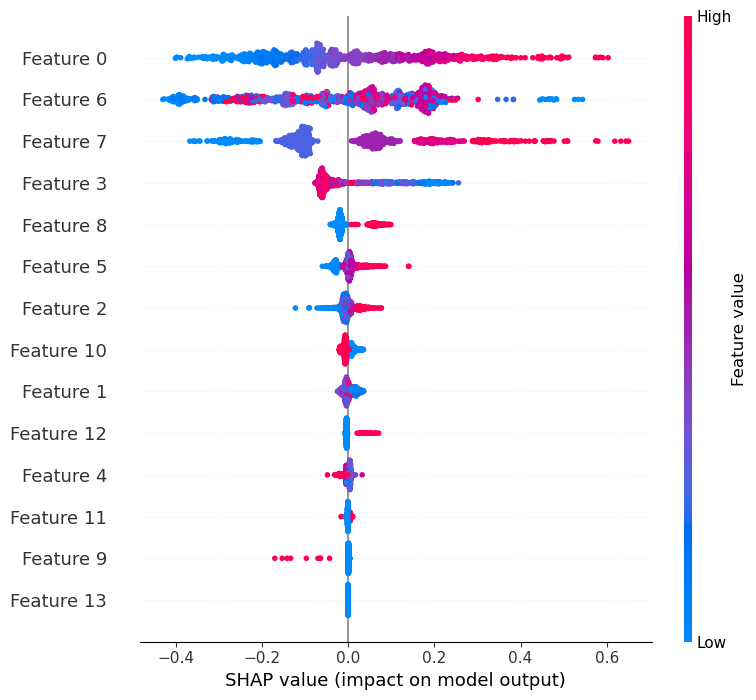
    


    
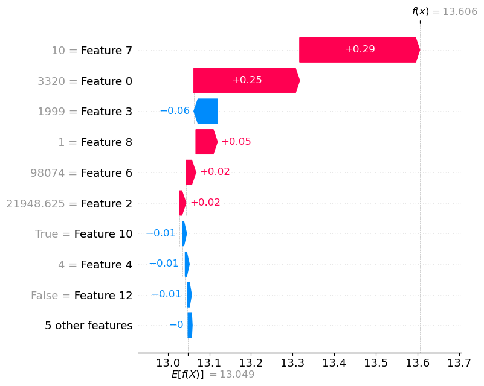
    


    
    All steps 6-9 completed (with safe fallbacks). Artifacts written: preprocessor.joblib, best_*_model.joblib (if trained), model_comparison_results.csv, and figure PNGs.
    


Step 10 — Export Cleaned Data 


```python
df.to_csv("Cleaned_Property_Data2512.csv", index=False)
```


```python

```
